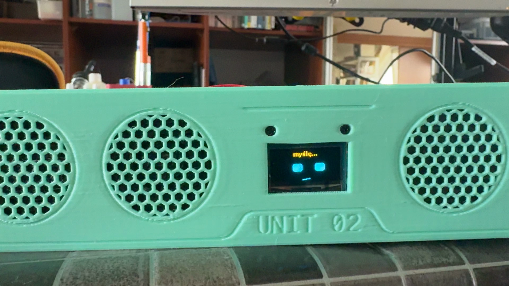
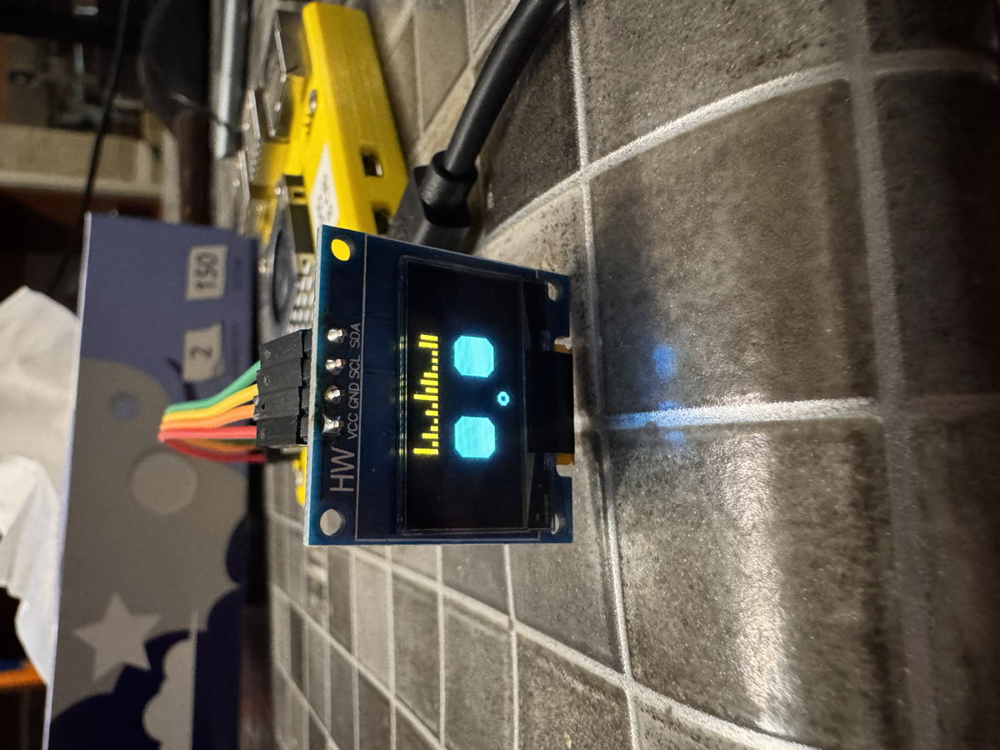
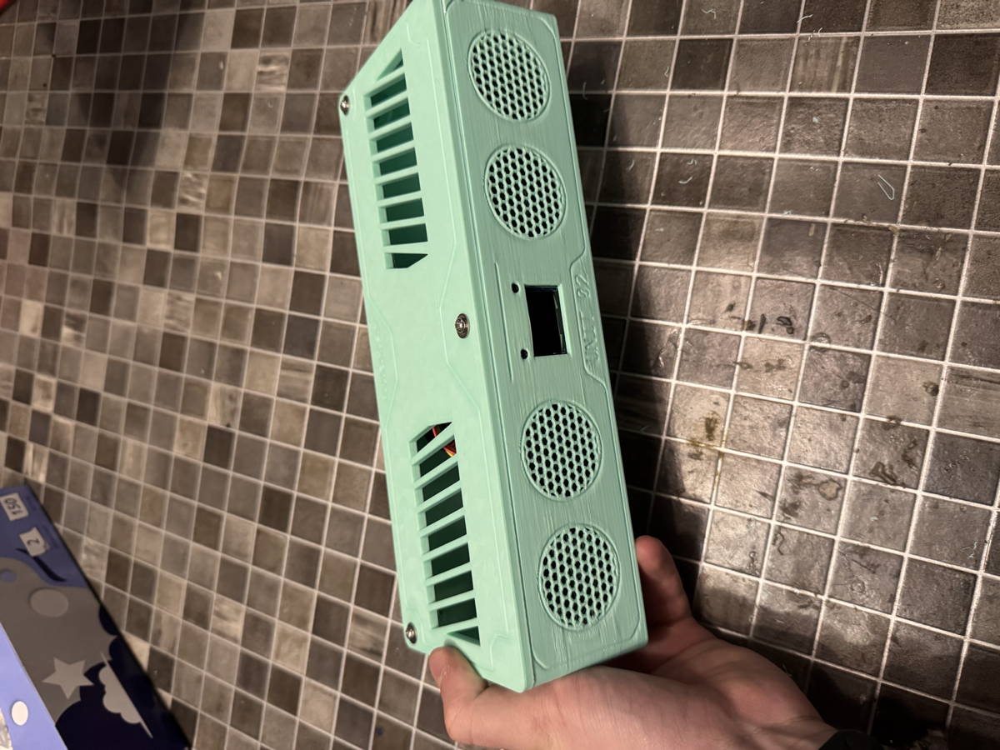
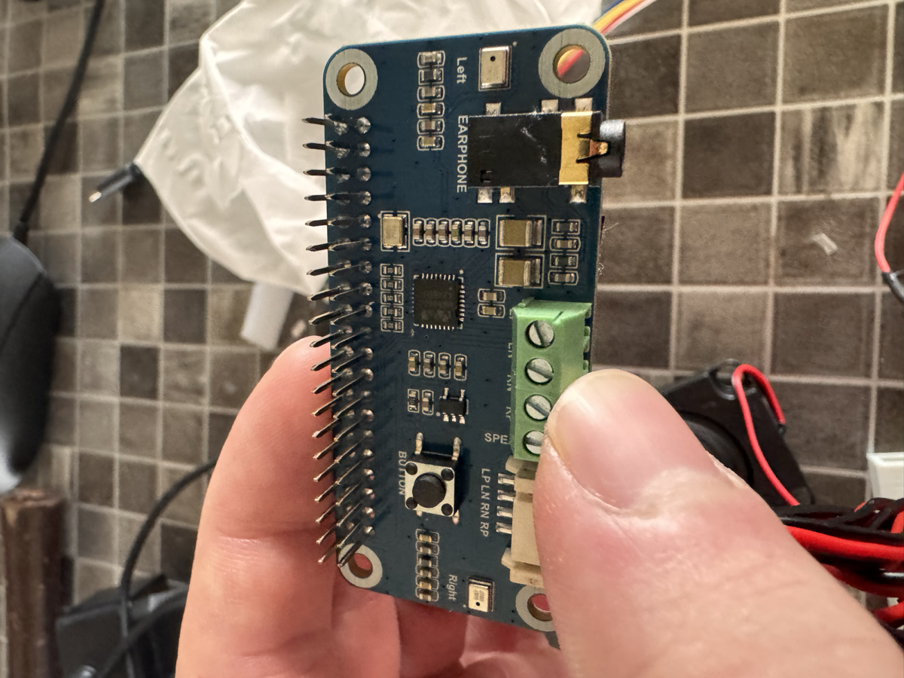
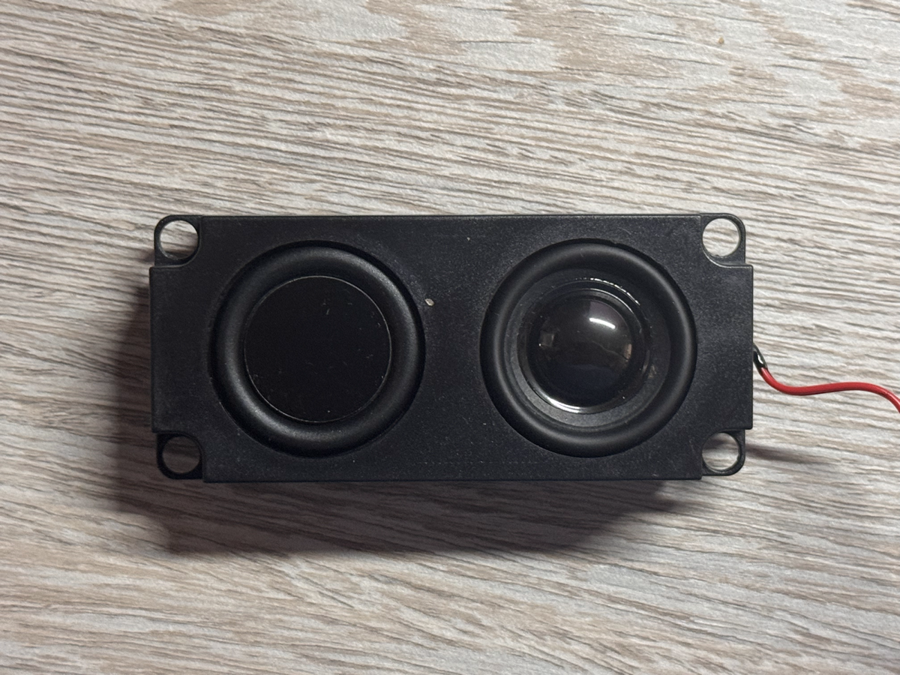

# A.L.E.K.S.Y v2

A Polish-speaking voice assistant built for the stand of our university's science club (KNI) during the adaptation days at the Maritime University of Szczecin. You say "Aleksy", ask a question, and it answers out loud in a cloned voice of the real Aleksy, the friend the project is named after. A small OLED face shows what it is doing.

## Background

The first version ran entirely on an NVIDIA Jetson Xavier NX with a local LLM, so it worked offline. In practice it took 20 to 30 seconds to answer, the model could barely hold a conversation, the lavalier microphone ran on batteries and the homemade amplifier picked up electrical noise from the board.

Version two splits the work in two. A Raspberry Pi 5 does only what has to happen in the room: wake word, recording, playback and the face. Everything heavy happens on a Mac mini over the network.

## How it works

1. The Pi listens for the wake word and says "tak" when it hears it.
2. Voice activity detection decides when you stopped talking. The Pi plays a short filler ("chwileczkę", "momencik") to cover the wait.
3. The recording goes to the server over a WebSocket.
4. The server transcribes it, sends it to the LLM along with the last few turns of the conversation, and synthesizes the answer in Aleksy's voice.
5. Audio streams back to the Pi together with the transcript, the answer and the time spent on each stage.

| Stage | Model |
| --- | --- |
| Wake word | microWakeWord ("alexa" model, tuned to fire on "Aleksy") |
| Voice activity | microVAD |
| Speech to text | Qwen3-ASR 0.6B (8-bit, MLX) |
| Language model | GPT-6 Luna through the OpenAI API, falling back to a local Qwen3-8B (4-bit, MLX) |
| Text to speech | OmniVoice with voice cloning (MLX) |

The system prompt makes it act as the host of the club's stand. It answers in two to four sentences, suggests one of the club's projects that fits the conversation, and writes every number, date and time out in words so the TTS reads it correctly.

On the Pi there is also a small web panel that shows the live face, the conversation history with stage timings, and the logs. It is also where you pick a Wi-Fi network or a Bluetooth speaker.

## Hardware

- Raspberry Pi 5 with the official 27 W power supply
- Waveshare WM8960 Audio HAT (microphones and amplifier)
- Two passive speakers, later replaced by a Soundcore Bluetooth speaker
- 0.96" 128x64 OLED over I2C
- 3D printed case
- Mac mini M2 (16 GB) as the server, with a MacBook as a backup

| | |
| --- | --- |
|  |  |
|  |  |

The face is a small state machine with six states: idle, listening, thinking, talking, asleep and error. It falls asleep after 30 seconds without a wake word.

The client deploys itself. Jenkins runs on the Pi, polls the repository every minute, syncs the code and restarts the systemd service.

## Problems along the way

- **The OLED showed a single column.** It was not the display or the wiring. It was the power supply. With the official 27 W supply it worked on the first try.
- **The Audio HAT takes the whole GPIO header.** The OLED had to be wired to the I2C bus it shares with the audio codec, and the standoffs between the boards had to go to make everything fit.
- **The case took several iterations.** The first one did not fit the 0.96" display or the speakers. The first full print was on bad filament with supports that were painful to remove, the speakers needed force to go in, and the M3 holes were too small. A friend, Scarlet, later reprinted the final version on better filament.
- **No Docker.** MLX needs Metal, which is not available inside a container on macOS, and on the Pi it would have been one more layer for nothing.
- **The Mac mini M2 is slow.** My M5 Pro laptop beats it easily. To keep answers under a few seconds, the TTS runs at 16 diffusion steps instead of 32, and answers are capped at 300 characters.
- **Streaming sentence by sentence made things worse.** It started speaking sooner, but synthesis on the M2 barely keeps up with playback, so there were pauses between sentences. In the end the whole answer is synthesized in one go.
- **The local LLM was not good enough.** Qwen3-8B stayed as a fallback, and the main model moved to the OpenAI API for the event.
- **The speakers were too quiet.** At the event, in a hall full of stands, almost nobody could hear it. Afterwards I added support for a Bluetooth speaker, picked from the panel.
- **No internet at the venue.** Without a network it could not reach the server at all. Now it starts its own hotspot when no known network is around, and the panel lets you choose a new one and enter the password.
- **The Bluetooth speaker cut off short words.** It went to sleep between answers and woke up too late for "tak". A WirePlumber rule keeps it awake.

## Takeaways

- Splitting the device from the compute was the right call. The Pi stays cheap, small and cool, and the models can change without touching the hardware.
- Latency matters more than answer quality. A short filler word right after you stop talking does more for how it feels than a better model.
- A demo device has to work in the worst room, not on the desk at home. Volume and connectivity were what failed at the event, not the AI.
- Anything that depends on the venue's network needs a plan B built in, not a cable you hope will be there.
- Power problems look like software problems. Rule out the power supply first.
- Measure the target hardware early. Every time on the Mac mini was a surprise compared to my laptop.
- 3D printing tolerances need slack: 3.5 mm holes for M3 screws, not 3.2 mm.
